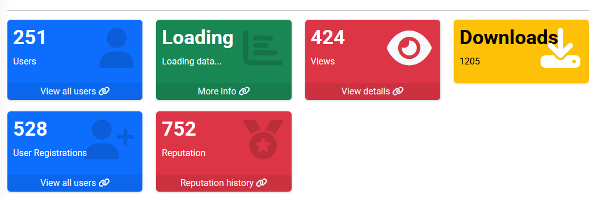
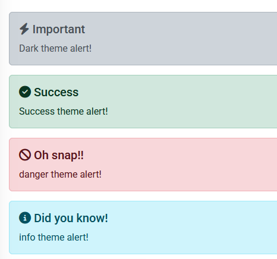

# Hawkiq AdmLTE Package

- Warning : This Package is at very early phase of development using it in production might not a good idea use at your own risk.
- This Package Heavely Inspired by [Laravel-AdminLTE](https://github.com/jeroennoten/Laravel-AdminLTE) for AdminLTEv3, I used thier Components with few modifications to make it suitable for AdminLTEv4.
---

Hawkiq AdmLTE is a Laravel package designed for seamless integration of the AdminLTE v4 beta template, providing a robust foundation for admin dashboards. This package simplifies the installation, configuration, and usage of AdminLTE with Bootstrap 5 and related components.

---

## Installation

Follow these steps to install and set up the Hawkiq AdmLTE package:

### Step 1: Require the Package

Note : This package used an expermintal AdminLTE V4 so it wont be installed on Laravel project unless you mark `"minimum-stability"` to `"dev"` in `composer.json`

```json
"minimum-stability": "dev",
"prefer-stable": true
```
after you change  Add the package to your Laravel project via Composer:

```bash
composer require hawkiq/admlte
```

### Step 2: Publish Assets, Lang, and Configurations

Run the following Artisan command to publish the package's assets,language and configuration files:
```bash
php artisan admlte:install
```

This will:
- Copy AdminLTE assets (CSS, JS, images) to `public/vendor`.
- Publish the configuration file to `config/admlte.php`.
- Publish Languages files to `lang/` or `resources/lang/`.

### Step 3: Replace Auth Views ( Optional )

If you would like to use AdminLTE Auth views you can run below command to replace views:

```bash
php artisan admlte:install --only=auth_views
```
this step is safe since its taking backup in `storage` folder for current views so if anything wrong happened you can always restoring old views.

---

## Configuration

Customize the package by editing the configuration file located at:
```bash
config/admlte.php
```

Key configurations include:
- Sidebar links and permissions.
- Navbar components.
- Custom assets and scripts.

Example `config/admlte.php`:
```php
return [
    'sidebar' => [
        [
            'type' => 'header',
            'text' => 'main.navigation',
            'permission' => null,
        ],
        [
            'type' => 'link',
            'text' => 'Dashboard',
            'route' => 'test1',
            'icon' => 'fas fa-home',
            'permission' => null,
        ],
          [
            'type' => 'link',
            'text' => 'Test Link',
            'route' => 'test2',
            'icon' => 'fas fa-cog',
            'permission' => null,
        ],
    ],
];
```

---

## Usage

### Include the Layout
To use the package's layout, extend the base layout in your Blade files:

```blade
@extends('admlte::page')
```
want to include auth layout just use AdmLTE auth layouts:

#### for login page
```blade
@extends('admlte::auth.login')

```

#### for register page
```blade
@extends('admlte::auth.register')

```

# Customizing Views
If you need to customize views,
```bash
php artisan admlte::install --only=views
```
- Publish customizable views to `resources/views/vendor/admlte`.

---

# Widgets
I've created few widget for easy use in your project, I'll try to make more in near future. all widgets use bootstrap 5 color names ( primary - success - danger - warning - light - dark - secondary ), till now there are no AdminLTE colors.

## Card
To create Cards with minimal efforts you can use Card widget and pass the required informations to make it works, here are few examples, when I create a wiki page I will give full details on each component.
```html

<x-admlte-card icon="fas fa-users" theme-mode="full" title="Header Card" theme="primary">
    A card with header using primary color ...
</x-admlte-card>

<x-admlte-card theme="danger" theme-mode="outline">
    A card without header has red border ...
</x-admlte-card>

<x-admlte-card icon="fas fa-cog" title="No theme-mode" theme="warning">
    A card with header using warning color but without theme-mode attribute...
</x-admlte-card>
```


## Info Box
For display small infos with icons or progress bar 

```html

<x-admlte-info-box class="shadow" title="CPU Traffic" text="424" icon-theme="primary"
    icon="fas fa-lg fa-cog" theme="light" />

<x-admlte-info-box title="Downloads" text="1205" icon="fas fa-lg fa-download"
    icon-theme="danger" />

<x-admlte-info-box title="User Registrations" text="251" icon="fas fa-lg fa-user-plus"
    theme="success" />

<x-admlte-info-box title="Tasks" text="75/100" icon="fas fa-lg fa-tasks" theme="warning"
    progress=75 progress-theme="dark" description="75% of the tasks have been completed" />

<!-- Updatable -->
<x-admlte-info-box title="Reputation" text="0/1000" icon="fas fa-lg fa-medal text-dark"
    theme="danger" id="ibUpdatable" progress=0 progress-theme="teal"
    description="0% reputation completed to reach next level" />
                

```

you can test `updateable` Info box with this js code

```html
<script>
    $(document).ready(function() {

        let iBox = new _AdminLTE_InfoBox('ibUpdatable');

        let updateIBox = () => {
            // Update data.
            let rep = Math.floor(1000 * Math.random());
            let idx = rep < 100 ? 0 : (rep > 500 ? 2 : 1);
            let progress = Math.round(rep * 100 / 1000);
            let text = rep + '/1000';
            let icon = 'fas fa-lg fa-medal ' + ['text-primary', 'text-light', 'text-warning'][idx];
            let description = progress + '% reputation completed to reach next level';

            let data = {
                text,
                icon,
                description,
                progress
            };
            iBox.update(data);
        };

        setInterval(updateIBox, 5000);
    })
</script>

```


## Small Box
For display one info with beautiful UI

```html

<x-admlte-small-box theme="primary" title="251" text="Users" icon="fas fa-user" url="#"
    url-text="View all users" url-icon="fas fa-link" />


<x-admlte-small-box title="Loading" text="Loading data..." icon="fas fa-chart-bar" theme="success"
    url="#" url-text="More info" />

<x-admlte-small-box title="424" text="Views" icon="fas fa-eye text-light" theme="danger"
    url="#" url-text="View details" />

<x-admlte-small-box title="Downloads" text="1205" icon="fas fa-download text-white"
    theme="warning" />

<x-admlte-small-box title="528" text="User Registrations" icon="fas fa-user-plus text-teal"
    theme="primary" url="#" url-text="View all users" />

<x-admlte-small-box title="0" text="Reputation" icon="fas fa-medal" theme="danger"
    url="#" url-text="Reputation history" id="sbUpdatable" />


```


## Alert
For display alerts 

```html
<x-admlte-alert theme="dark" title="Important">
    Dark theme alert!
</x-admlte-alert>

<x-admlte-alert theme="success" title="Success">
    Success theme alert!
</x-admlte-alert>


<x-admlte-alert theme="danger" title="Oh snap!!">
    danger theme alert!
</x-admlte-alert>


<x-admlte-alert theme="info" title="Did you know!">
    info theme alert!
</x-admlte-alert>


```


---

## Contribution
Contributions are welcome! Feel free to fork the repository and submit a pull request.

---

## License
This package is open-sourced software licensed under the [MIT license](LICENSE).

